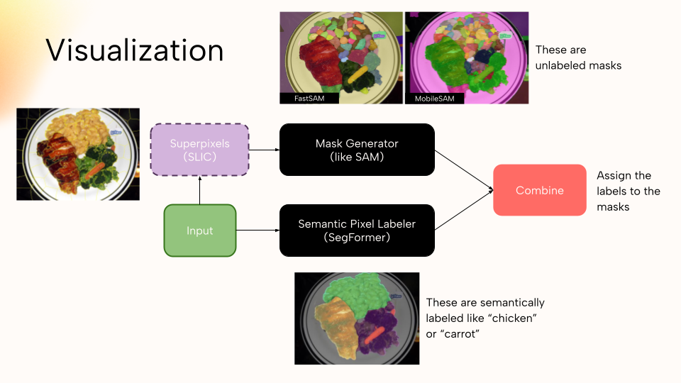

# FastFood - Food Image Segmentation
A food image segmentation pipeline built with SegFormer, MobileSAM, and SLIC Superpixels

## Overview

This project implements a food image semantic segmentation pipeline for the **FoodSeg103** dataset by combining:

- **SegFormer** — SegFormer is used as the base label generation
- **Superpixels** — GPU accelerated SLIC used to generated superpixels in milliseconds. Superpixels are used to greatly reduce the number of prompt points to SAM models, lowering inference latency and computational cost
- **SAM Models** - SAM models like FastSAM and MobileSAM can be used to do everything segmentation, which partitions an image into masks which can precisely cover objects or patterns in the image.

SegFormer is good at label generation, but can struggle to create precise masks, and SAM cannot generate labels, but can create high quality masks. Our idea was to merge their strengths.

Visualization of pipeline:


## Project Structure

```
project/
├── configs/                       # Dataset config: 104 class name maps      
├── models/                        # Mask generation models (SAM)
├── utils/
│   └── data_loader.py             # FoodSeg103Dataset + visualisation helpers
├── pipeline_<type>.py                    # Main orchestrator (CLI + Python API)
├── evaluate_<type>.py                    # Full dataset evaluation (mIoU, FPS)
├── test_<type>.py                        # Test a specific method on an image
├── train_segformer.py             # SegFormer-B0 training script
├── download_dataset.py            # Downloads FoodSeg103 from HuggingFace
├── setup_repos.py                 # Clones EfficientSAM3 to use that model
└── requirements.txt               # Python dependencies
```

## Note on Files

You will find 2 sets of files called `eval_<pipeline>.py` and `test_<pipeline>.py`. Use the `eval` script to run the pipeline on the full dataset and get metrics, and use the `test` script to run the pipeline on specific images and get a sample outpue. The eval and test scripts can be done with the following pipelines:

- Base SegFormer `python eval_segformer.py`
- Superpixels + MobileSAM + SegFormer (`python eval_hybrid_ensemble.py --sp_prompt --no_yolo`)
- MobileSAM + SegFormer (`python eval_hybrid_ensemble.py --no_yolo`)
- FastSAM + SegFormer (`python eval_fastsam.py`)
- EfficientSAM + SegFormer (`python eval_efficientsam.py`)

## Results

| Method                              | mIoU | mAcc | Pixel Accuracy | Latency(s) |
|-------------------------------------|------|------|----------------|------------|
| Finetuned Segformer (25 Epochs)     | 36.4 | 53.0 | 79.7           | 0.1        |
| FastSAM + SegFormer                 | 29.3 | 38.4 | 74.6           | 0.1        |
| EfficientSAM3 + SegFormer           | 31.7 | 47.2 | 76.9           | 7.6        |
| MobileSAM + SegFormer               | 31.2 | 49.3 | 75.4           | 9.5        |
| Superpixels + MobileSAM + SegFormer | 33.8 | 47.2 | 77.0           | 2.2        |

## How to Set Up

### Step 1 — Create a virtual environment & install dependencies

```powershell
cd c:\Users\axd210123\Downloads\project
python -m venv venv
.\venv\Scripts\Activate.ps1
pip install -r requirements.txt
```

### Step 2 — Clone the external repositories

```powershell
python setup_repos.py
```

This clones:
- `efficientsam3/` — the EfficientSAM3 repo (for `sam3` package)

Then install EfficientSAM3 as a package:

```powershell
pip install -e "efficientsam3"
```

### Step 3 — Download model weights

Create a `weights/` directory and download the following checkpoints:

| Model | Download Link | Save As |
|-------|--------------|---------|
| EfficientSAM3 EfficientViT-S (image encoder) | [HuggingFace](https://huggingface.co/Simon7108528/EfficientSAM3/resolve/main/stage1_all_converted/efficient_sam3_efficientvit_s.pt) | `weights/efficient_sam3_efficientvit_s.pt` |
| EfficientSAM3 TinyViT-M + MobileCLIP-S1 (text) | [HuggingFace](https://huggingface.co/Simon7108528/EfficientSAM3/resolve/main/stage1_all_converted/efficient_sam3_tinyvit_11m_mobileclip_s1.pth) | `weights/efficient_sam3_tinyvit_m_mobileclip_s1.pt` |

### Step 4 — Download the FoodSeg103 dataset

```powershell
python download_dataset.py
```

This downloads from HuggingFace and saves images/annotations to `data/FoodSeg103/`.

### Step 5 — Train the SegFormer closed-set branch

```powershell
python train_segformer.py
```

This fine-tunes a SegFormer-B0 on FoodSeg103 for 10 epochs and saves checkpoints to `weights/segformer_foodseg103_epoch_<N>/`. Use the best epoch as your closed-set branch checkpoint.

**Pretrained 25 epoch SegFormer model can be found here:**
[SegFormer Weights - Place in `weights/`](https://cometmail-my.sharepoint.com/:u:/g/personal/axd210123_utdallas_edu/IQBCN8PMPPHUTYFdLWU35EtKAcrls4fjJe2ULPIXbxfOLxk?e=qNosO9)

Other model weights (MobileSAM/FastSAM) will be automatically downloaded whenever a script that needs the model is first run.

## How to Run

See which script to run above in list of pipelines.

### Full dataset evaluation

```powershell
python eval_<type>.py --data_dir data/FoodSeg103 --split test --out_dir output/eval
```

This will output various charts like confusion matrix, per calss accuracy and IoU, and some sample predictions to the output directory.

### Single image inference

```powershell
python test_<type>.py --image path/to/food_image.jpg --out_dir output
```

Outputs saved to `output/`:

