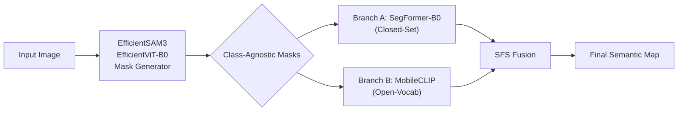

# Semantic-EfficientSAM3 Pipeline — Walkthrough

## Overview

This project implements a food image semantic segmentation pipeline for the **FoodSeg103** dataset by combining:

- **EfficientSAM3** — lightweight distilled SAM3 models (replaces FastSAM for mask generation, and BLIP/CLIP for open-vocabulary labeling)
- **Semantic-Fast-SAM (SFS)** — the two-stage pipeline architecture (mask generation → semantic labeling with fusion)



## Project Structure

```
project/
├── configs/
│   ├── __init__.py
│   └── foodseg103_classes.py      # 104 class names & ID ↔ label mappings
├── models/
│   ├── __init__.py
│   ├── mask_generator.py          # EfficientSAM3 mask generation wrapper
│   ├── semantic_branch.py         # ClosedSetBranch + OpenVocabBranch
│   └── fusion.py                  # SFS fusion heuristic
├── utils/
│   ├── __init__.py
│   └── data_loader.py             # FoodSeg103Dataset + visualisation helpers
├── pipeline.py                    # Main orchestrator (CLI + Python API)
├── evaluate.py                    # Full dataset evaluation (mIoU, FPS)
├── train_segformer.py             # SegFormer-B0 training script
├── download_dataset.py            # Downloads FoodSeg103 from HuggingFace
├── setup_repos.py                 # Clones EfficientSAM3 & Semantic-Fast-SAM repos
├── requirements.txt               # Python dependencies
└── message.md                     # Original design document
```

## Files Created

| File | Purpose |
|------|---------|
| [requirements.txt](file:///c:/Users/axd210123/Downloads/project/requirements.txt) | Python dependencies |
| [setup_repos.py](file:///c:/Users/axd210123/Downloads/project/setup_repos.py) | Clones EfficientSAM3 & SFS repos |
| [download_dataset.py](file:///c:/Users/axd210123/Downloads/project/download_dataset.py) | Downloads FoodSeg103 from HuggingFace |
| [train_segformer.py](file:///c:/Users/axd210123/Downloads/project/train_segformer.py) | Trains SegFormer-B0 on FoodSeg103 |
| [configs/foodseg103_classes.py](file:///c:/Users/axd210123/Downloads/project/configs/foodseg103_classes.py) | 104 food class names and ID↔label maps |
| [models/mask_generator.py](file:///c:/Users/axd210123/Downloads/project/models/mask_generator.py) | EfficientSAM3 point-grid mask generator |
| [models/semantic_branch.py](file:///c:/Users/axd210123/Downloads/project/models/semantic_branch.py) | ClosedSetBranch (SegFormer) + OpenVocabBranch (MobileCLIP) |
| [models/fusion.py](file:///c:/Users/axd210123/Downloads/project/models/fusion.py) | SFS fusion decision logic |
| [utils/data_loader.py](file:///c:/Users/axd210123/Downloads/project/utils/data_loader.py) | FoodSeg103Dataset + visualisation |
| [pipeline.py](file:///c:/Users/axd210123/Downloads/project/pipeline.py) | Main pipeline orchestrator |
| [evaluate.py](file:///c:/Users/axd210123/Downloads/project/evaluate.py) | mIoU evaluation on FoodSeg103 |

## How to Set Up

### Step 1 — Create a virtual environment & install dependencies

```powershell
cd c:\Users\axd210123\Downloads\project
python -m venv venv
.\venv\Scripts\Activate.ps1
pip install -r requirements.txt
```

### Step 2 — Clone the external repositories

```powershell
python setup_repos.py
```

This clones:
- `efficientsam3/` — the EfficientSAM3 repo (for `sam3` package)
- `semantic_fast_sam/` — the Semantic-Fast-SAM repo (reference implementation)

Then install EfficientSAM3 as a package:

```powershell
pip install -e "efficientsam3[stage1]"
```

### Step 3 — Download model weights

Create a `weights/` directory and download the following checkpoints:

| Model | Download Link | Save As |
|-------|--------------|---------|
| EfficientSAM3 EfficientViT-S (image encoder) | [HuggingFace](https://huggingface.co/Simon7108528/EfficientSAM3/resolve/main/stage1_all_converted/efficient_sam3_efficientvit_s.pt) | `weights/efficient_sam3_efficientvit_s.pt` |
| EfficientSAM3 TinyViT-M + MobileCLIP-S1 (text) | [HuggingFace](https://huggingface.co/Simon7108528/EfficientSAM3/resolve/main/stage1_all_converted/efficient_sam3_tinyvit_11m_mobileclip_s1.pth) | `weights/efficient_sam3_tinyvit_m_mobileclip_s1.pt` |

### Step 4 — Download the FoodSeg103 dataset

```powershell
python download_dataset.py
```

This downloads from HuggingFace and saves images/annotations to `data/FoodSeg103/`.

### Step 5 — Train the SegFormer closed-set branch

```powershell
python train_segformer.py
```

This fine-tunes a SegFormer-B0 on FoodSeg103 for 10 epochs and saves checkpoints to `weights/segformer_foodseg103_epoch_<N>/`. Use the best epoch as your closed-set branch checkpoint.

## How to Run

### Single image inference

```powershell
python pipeline.py --image path/to/food_image.jpg --out_dir output --device cuda
```

Outputs saved to `output/`:
- `<basename>_segmap.png` — colourised semantic segmentation map
- `<basename>_overlay.png` — semi-transparent overlay on original image

### Full dataset evaluation

```powershell
python evaluate.py --data_dir data/FoodSeg103 --split test --out_dir output/eval --device cuda
```

Outputs:
- Per-class IoU and mIoU printed to console
- `output/eval/evaluation_results.txt` — saved metrics
- First 20 overlay images saved for visual inspection

## Key Design Decisions

1. **EfficientSAM3 replaces FastSAM** — Uses `build_efficientsam3_image_model` with `EfficientViT-B0` backbone + `predict_inst` with a point grid, yielding higher-quality boundaries than FastSAM's YOLO-based approach.

2. **MobileCLIP replaces BLIP+CLIP** — Instead of generating captions then ranking them, we directly score each mask crop against the fixed 103 food class names via `Sam3Processor.set_text_prompt`. This eliminates the BLIP captioning bottleneck.

3. **Fusion follows SFS heuristic** — Closed-set branch is trusted when confident (≥50% pixel agreement). Open-vocab branch overrides only with strong score (≥0.8). Ambiguous cases fall back to closed-set.

4. **Repos cloned, not submoduled** — Both repos are cloned as plain directories for simplicity. EfficientSAM3 is installed as an editable package so its `sam3` module is importable.
